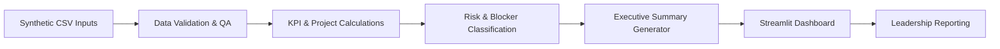

<div align="center">

# 🚀 Growth & Operations Command Center

### Public-Safe Operations Intelligence for KPI Governance, Project Visibility, Risk Escalation, and Executive Reporting

[](#-project-status)
[](#-technology-stack)
[](#-technology-stack)
[](#-public-safe-data-policy)
[](LICENSE)

<br>

> A portfolio case study demonstrating how fragmented project updates, KPIs, blockers, decisions, and weekly reporting can be converted into a structured leadership operating system.

</div>

---

## 📌 Quick Navigation

[Overview](#-project-overview) •
[Business Problem](#-business-problem) •
[Solution](#-proposed-solution) •
[Architecture](#-system-architecture) •
[Features](#-planned-features) •
[Data Model](#-planned-data-model) •
[QA Rules](#-qa-and-governance-rules) •
[Roadmap](#-project-status) •
[Author](#-author)

---

## 🧭 Project Overview

The **Growth & Operations Command Center** is a public-safe operations intelligence system designed to centralize:

| Operational Layer | What It Tracks |
|---|---|
| 📁 Project Portfolio | Ownership, priority, status, milestones, and due dates |
| 📊 KPI Governance | Targets, actuals, variance, data source, and validation |
| 🚧 Blockers & Risks | Severity, impact, escalation, owner, and resolution |
| 🧾 Decision Log | Context, decision owner, evidence, and follow-up action |
| 🗓️ Executive Reporting | Weekly accomplishments, KPI movement, risks, and priorities |

This repository is being developed as a portfolio case study for roles including:

- Growth Operations Analyst
- Marketing Operations Analyst
- Business Analytics Analyst
- Marketing Technology Analyst
- AI Operations Analyst
- Marketing Analytics Engineer

---

## 🎯 Business Problem

Operational information is often scattered across spreadsheets, emails, meeting notes, dashboards, and individual project trackers.

This creates several business risks:

| Risk | Business Impact |
|---|---|
| Inconsistent project visibility | Leadership cannot quickly determine what is on track or delayed |
| Unclear KPI ownership | Metrics are reported without accountability or validation |
| Weak blocker escalation | High-impact issues remain unresolved too long |
| Missing decision history | Teams lose context and repeat prior discussions |
| Manual weekly reporting | Time is spent consolidating updates instead of acting on them |
| Disconnected evidence | Project claims become difficult to verify |

The Command Center addresses these issues through a structured, analytics-ready operating model.

---

## 🛠️ Proposed Solution

The system will combine five connected operational layers.

### 1. 📁 Project Portfolio

- Project owner
- Business objective
- Priority
- Status
- Milestone progress
- Due dates
- Evidence references

### 2. 📊 KPI Governance

- Metric definition
- Target
- Actual result
- Variance
- Data source
- Validation status
- Reporting cadence

### 3. 🚧 Blocker & Risk Management

- Severity
- Business impact
- Owner
- Escalation status
- Resolution date
- Days blocked

### 4. 🧾 Decision Log

- Decision
- Context
- Decision owner
- Date
- Supporting evidence
- Follow-up action

### 5. 🧠 Executive Reporting

- Weekly accomplishments
- KPI movement
- Critical blockers
- Decisions required
- Next priorities
- Leadership-ready summary

---

## 🧩 System Architecture



### Planned Processing Flow

```text
Synthetic CSV Inputs
        ↓
Schema Validation
        ↓
Data Quality Checks
        ↓
KPI Calculations
        ↓
Risk Classification
        ↓
Executive Summary Generation
        ↓
Interactive Dashboard
```

---

## 🗂️ Planned Repository Structure

```text
growth-operations-command-center/
├── data/
│   ├── synthetic_projects.csv
│   ├── synthetic_kpis.csv
│   ├── synthetic_blockers.csv
│   ├── synthetic_decisions.csv
│   └── synthetic_weekly_updates.csv
├── src/
│   ├── validate_data.py
│   ├── calculate_kpis.py
│   ├── classify_risks.py
│   └── generate_executive_summary.py
├── dashboard/
│   └── streamlit_app.py
├── docs/
│   ├── architecture.md
│   ├── data_dictionary.md
│   ├── qa_rules.md
│   └── case_study.md
├── images/
├── tests/
├── requirements.txt
├── LICENSE
└── README.md
```

---

## ✨ Planned Features

| Feature | Business Purpose | Status |
|---|---|---|
| 📁 Synthetic project register | Track ownership, status, priority, and milestones | Planned |
| 📊 KPI calculation engine | Compare targets, actuals, and variance | Planned |
| ✅ Data-quality validation | Detect missing values, duplicates, and invalid records | Planned |
| 🚨 Blocker classification | Rank risks by urgency and business impact | Planned |
| 🧾 Decision log | Preserve context and follow-up ownership | Planned |
| 🧠 Executive summary generator | Produce leadership-ready weekly updates | Planned |
| 📈 Streamlit dashboard | Visualize portfolio health and operational risks | Planned |
| 🧪 Automated tests | Validate calculations and governance rules | Planned |

---

## 🗃️ Planned Data Model

### Project Register

| Field | Description |
|---|---|
| `project_id` | Unique project identifier |
| `project_name` | Project title |
| `owner` | Accountable project owner |
| `priority` | Low, Medium, High, or Critical |
| `status` | Planning, On Track, At Risk, Blocked, or Complete |
| `progress_pct` | Milestone completion percentage |
| `due_date` | Target completion date |

### KPI Register

| Field | Description |
|---|---|
| `kpi_id` | Unique KPI identifier |
| `project_id` | Related project |
| `metric_name` | KPI name |
| `target_value` | Planned target |
| `actual_value` | Current result |
| `variance` | Difference between target and actual |
| `validation_status` | Pending, Validated, or Review Required |

### Blocker Register

| Field | Description |
|---|---|
| `blocker_id` | Unique blocker identifier |
| `project_id` | Related project |
| `severity` | Low, Medium, High, or Critical |
| `impact` | Business impact description |
| `owner` | Resolution owner |
| `status` | Open, Escalated, or Closed |
| `resolution_date` | Date resolved, when applicable |

---

## 📈 Example KPI Categories

The synthetic dataset will include metrics such as:

- Active projects
- Projects on track
- Projects at risk
- Milestones completed
- KPI target attainment
- Open blockers
- High-severity risks
- Decisions pending
- Weekly completion rate
- Average days blocked

> All values will be synthetic and created solely for portfolio demonstration.

---

## ✅ QA and Governance Rules

The validation framework will check for:

- Unique project and KPI IDs
- Valid project statuses
- Valid priority and severity levels
- Required ownership fields
- Valid dates and date order
- Numeric KPI targets and actuals
- Duplicate records
- Missing evidence references
- Closed blockers without resolution dates
- Completed projects with incomplete milestones
- KPI records without related projects
- Decisions without owners or follow-up actions

---

## 💻 Technology Stack

### Data & Analytics


### Dashboard & Reporting


### Quality & Documentation


---

## 🔐 Public-Safe Data Policy

This repository will not contain confidential company, client, employee, tenant, owner, address, email, phone, or financial information.

The project will use:

- Synthetic records
- Generalized business logic
- Public-safe diagrams
- Recreated KPI visuals
- Anonymized operating models
- Sanitized portfolio documentation

The objective is to demonstrate the system design, analytical logic, governance controls, and reporting methodology without exposing private data.

---

## 🚦 Project Status

**Current phase:** Repository setup and technical design

### Development Roadmap

- [x] Create public repository
- [x] Define project scope
- [x] Document proposed architecture
- [ ] Add synthetic datasets
- [ ] Add validation pipeline
- [ ] Add KPI calculation engine
- [ ] Add blocker classification logic
- [ ] Add executive summary generator
- [ ] Build Streamlit dashboard
- [ ] Add automated tests
- [ ] Add screenshots and architecture diagrams
- [ ] Publish final portfolio case study

---

## 💼 Portfolio Value

This project is designed to demonstrate the ability to:

- Translate operational problems into structured systems
- Design governance-ready data models
- Build KPI and reporting workflows
- Apply QA controls to operational data
- Surface risks and blockers for leadership
- Automate executive reporting
- Document systems for future scale
- Connect analytics to management decision support

---

## 🔗 Related Portfolio Projects

| Project | Focus |
|---|---|
| [Lead Intelligence System](https://github.com/AnoohyaAlluri/lead-intelligence-system) | CRM matching, data quality, and attribution |
| [SEO / AEO / GEO Local Growth Framework](https://github.com/AnoohyaAlluri/seo-aeo-geo-local-growth-framework) | Search growth and content architecture |
| [Luxury Rental MLS Outreach Pipeline](https://github.com/AnoohyaAlluri/luxury-rental-mls-outreach-pipeline) | Growth automation and outreach operations |
| [Professional Portfolio](https://github.com/AnoohyaAlluri/anoohya-portfolio) | Recruiter-facing project portfolio |

---

## 👤 Author

<div align="center">

### Anoohya Alluri

**Marketing Technology • Analytics • Growth Operations • AI Workflows**

[](https://anoohya-portfolio.vercel.app/)
[](https://www.linkedin.com/in/anoohyaalluri/)
[](https://github.com/AnoohyaAlluri)
[](https://public.tableau.com/app/profile/anoohya.allurii/vizzes)

</div>

---

<div align="center">

### ✦ Public-safe portfolio implementation built with synthetic data

No confidential company or customer information is included.

</div>
