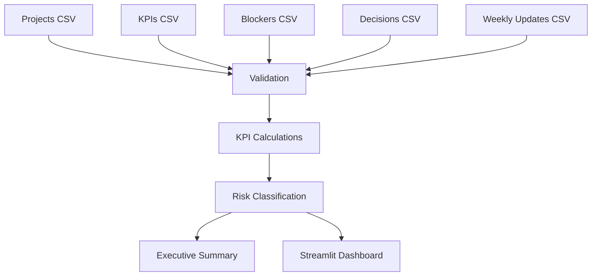

# System Architecture

## Objective

The Command Center converts multiple synthetic operating registers into a governed reporting layer for leadership.

## Components

1. **Source layer**
   - Projects
   - KPIs
   - Blockers
   - Decisions
   - Weekly updates

2. **Validation layer**
   - Schema and required-field checks
   - ID uniqueness
   - Referential integrity
   - Date validation
   - Business-rule validation

3. **Analytics layer**
   - KPI attainment
   - Project health
   - Risk scoring
   - Blocker aging
   - Portfolio summaries

4. **Reporting layer**
   - CSV outputs
   - Markdown executive summary
   - Streamlit dashboard

## Data Flow

## Reproducibility

The analytics pipeline uses a fixed synthetic reporting date of **2026-07-18** so the generated outputs remain reproducible.
